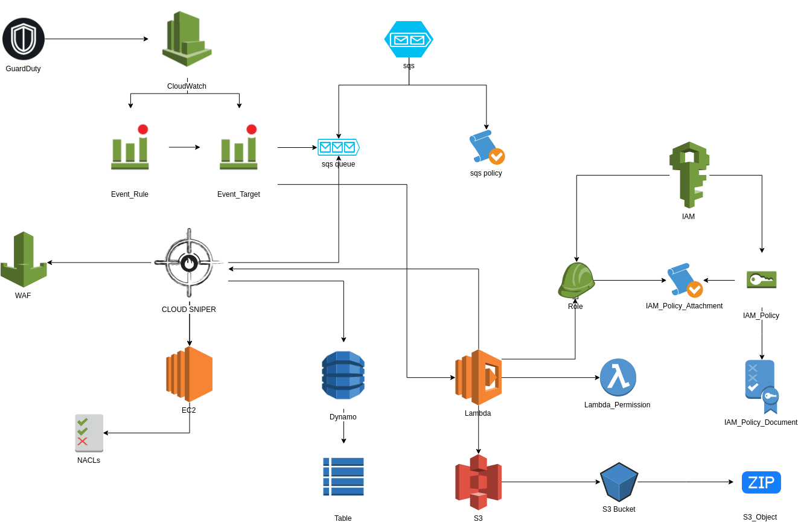

### *Cloud Security Operations*

***Cloud Sniper*** was designed to manage *Security Operations* in cloud-based environments. It is an open source platform that natively enables incident and response activities; is intended to be used as the main part of the *Security Operations Center (SOC)*.

With ***Cloud Sniper*** you can handle security incidents receiving external or cloud-based feeds and allows you to respond automatically with mitigation actions. 

At the same time, it makes it possible to generate a knowledge database of indicators of compromise (IOCs) that affect the platform. This is an excellent way to gain visibility in environments where information can be bounded due to the *Shared Responsibility Model* enforced by cloud providers.

It is currently available for **AWS** cloud environments, but will be extended to all cloud platforms.

### *Cloud Deployment*

1.  Already integrated with these AWS artifacts:
    1.  GuardDuty (all findings)
    2.  SQS
    3.  CloudWatch
    4.  WAF
    5.  EC2 NACLs
    6.  Dynamo
    7.  IAM
    8.  S3
    9.  Lambda

2. Upcoming features and integrations:
    1.  Currently ***Cloud Sniper*** runs within a lambda function, but the standalone version is on the way
    2.  Security analytics module
        1.  **Beaconing detection with VPC Flow Logs** (C2 detection analytics)
    3.  Case management (automatic case creation), IOCs enrichment and Threat Intelligence feeds: The Hive, Cortex and MISP
    4.  Tactics, Techniques and Procedures (TTPs). MITRE approach
    5.  Automatic security reports based on well-known security standards (*NIST*)
    6.  Security playbooks for cloud-based environments
    7.  Integration with third-party tools (DFIR)
    
3. Installation:
    You only need to have configured the *AWS profile* and the *Terraform* client.

    1.  Deployment (must be located inside the ***Cloud-Sniper*** folder):
        1.  terraform init
        2.  terraform plan
        3.  terraform apply [yes]

